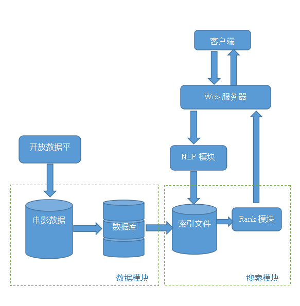
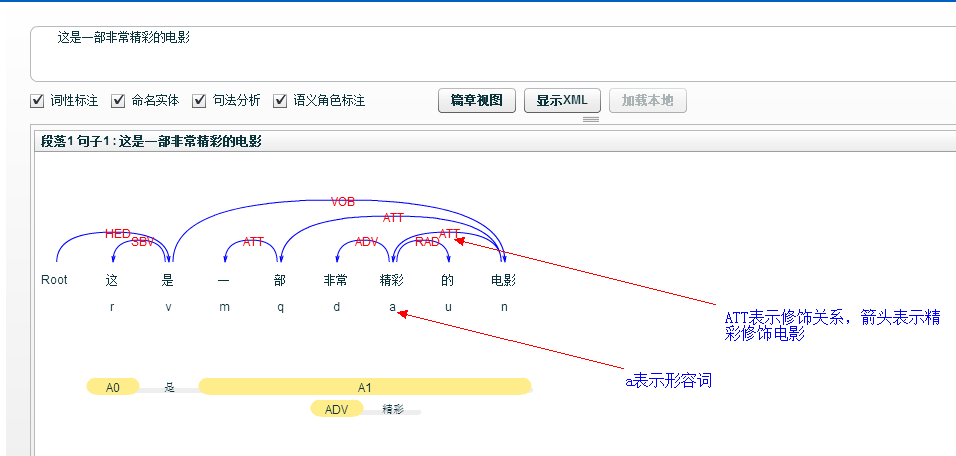
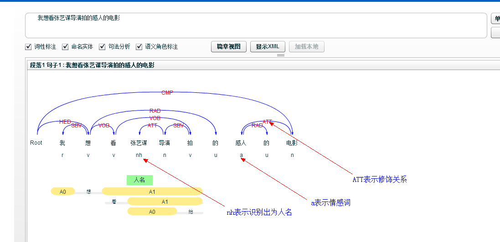
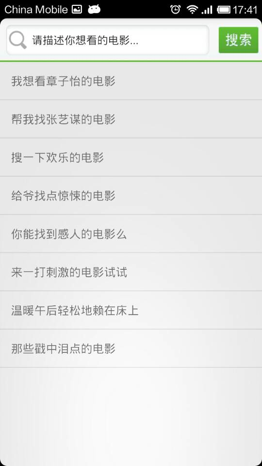
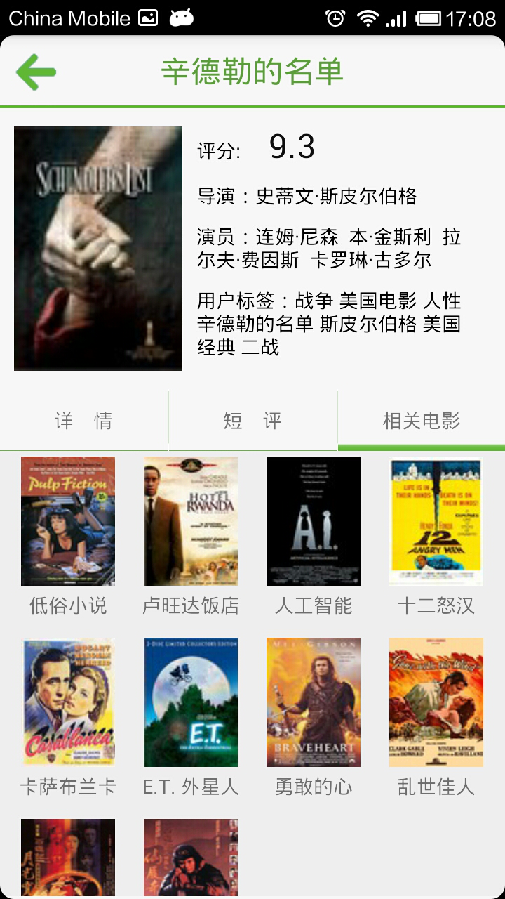
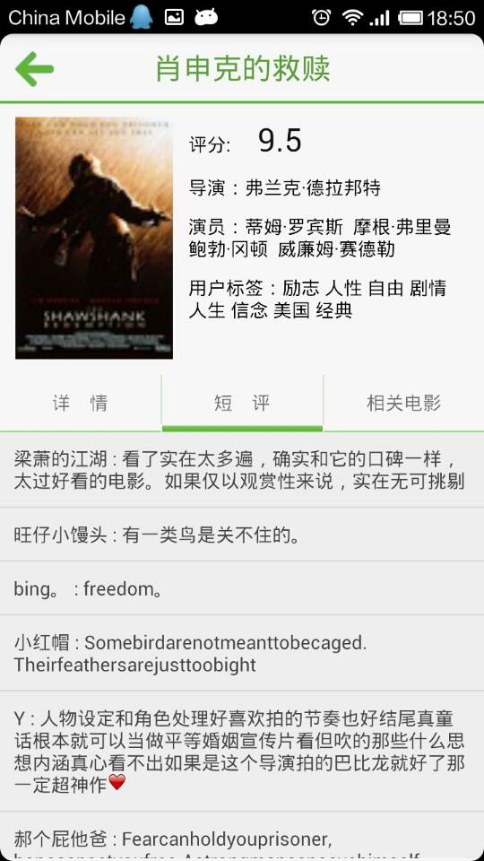
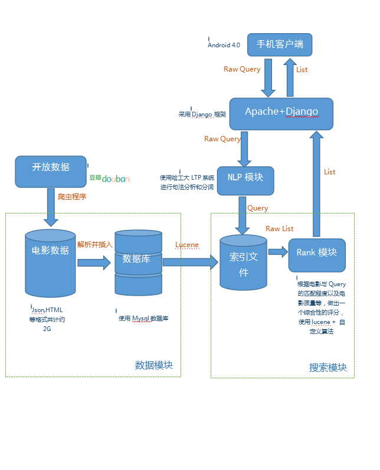

# 

#《心情电影》作品文档

# 

####——NG Studio

###一、背景与介绍
---

　　大数据时代的到来，人类的总信息量呈现出一种爆炸增长的趋势。市场研究机构IDC的调研结果显示，到2020年，全球数据容量将达到35 ZB(即35万亿TB)，比2009年增加44倍，且数据的类型和种类将更加复杂化。信息总量快速增长的同时，人们也越来越认识到这些信息的重要作用及价值，对于开放数据，开放信息的需求也慢慢地凸现出来。

<!-- [大数据](http://soft.chinabyte.com/399/12743899.shtml) -->

　　虽然信息的总量在迅速增长，但是大数据的处理一直是一个难点。IBM将大数据的特点归结为4V：Volume(数据量大)、Velocity(数据更新快)、Variety(数据多样)、Veracity(数据真实性)。 多数分析师认为，有高达85%的新数据都是非结构化的数据，例如文本、网络日志、视频、照片、地理信息等。
<!-- [大数据](http://soft.chinabyte.com/399/12743899.shtml) -->

　　如何从海量的数据中找到人们所需要的真正有用的信息，这越来越变成一个广泛存在而且亟待解决的问题，也成为近年来人们的研究热点，产生和带动了大量产业和技术。在开放数据方面，基于已有的开放数据，人们也进行了很多相关工作，包括数据挖掘，机器学习，云计算，搜索，统计，数据可视化等等，并且从中发现和抽取出了大量宝贵的信息。

　　就个人而言，面对当今如此海量而杂乱的数据，如何能够从中找到自己所需的信息，这是一个很有意义也很有挑战性的问题。人们对于这个问题也进行了很多探索，个性化的搜索技术便是其中一个很重要的方面。而当前的搜索技术大多还使用着关键字对网页进行全局搜索的搜索方式，这种方式在大多数情况下是很有用的，然而就某些领域而言，这种搜索方式有着明显的不足。

　　在电影、音乐搜索领域中，很多情况下现有的搜索无法满足以下需求：

* 问题一：人们很难把自己的需求浓缩成一个关键字，因为一般电影网站的搜索引擎只支持单域单关键字的搜索

* 问题二：有些情况下，人们根本很难说清楚自己想要找什么样的电影或者音乐。

　　对于第一个问题，几乎所有的电影搜索引擎都提供了高级搜索功能，用户可以根据自己的需求，点选或者输入自己的想要的电影的特征，从而搜索满足自己需求的电影。但是所有的高级搜索又都有以下弊端：

* 高级搜索太过复杂，用户需要一定的学习成本，用户鼠标点击选择或者手动分别输入电影所属国家，类型，导演等等信息，这是很繁琐的，在强调用户体验的今天，这种模式无疑会降低用户对其的使用率。
 
* 有时候用户很难将自己的需求用高级搜索的选择框表达出来。这其中有两个原因：
	+ 高级搜索的选项覆盖不到所有的用户需求。
	+ 用户自己难以准确表达自己需要什么样的电影。 

　　对于第二个问题，目前市场上还没有一种比较好的解决方案，用户大多只能自己在一些网页搜索引擎中凭着感觉寻找。而解决这个问题的方法主要有两点：

+ 得到更多更详细的电影特征，比如电影的情感色彩等。
+ 使用更加复杂的高级搜索，如果增加了电影的特征供用户搜索，那么就需要更加复杂的高级搜索功能，降低用户体验。

　　想要得到电影的更多特征，就需要对电影进行分析，可以使用自然语言处理技术来对电影特征进行提取。而要在不破坏用户体验的程度下进行多域的搜索，就需要能够自动判别关键词的域，或者用自然语言处理技术。众所周知，自然语言处理(NLP)问题很长时间以来一直是学术界以及工程界研究的热点与难点之一。想要完美地从繁杂的自然语言中抽取出用户所要的电影，几乎是不可能完成的任务。而我们所希望的是，能够在从被简单约束的搜索查询语句中得到用户的心理状态(即感情)以及电影的基本属性信息，比如导演、电影类型等。从而实现一种更加人性的搜索方式。

　　心情电影就是这样一个应用，可以让人们在厌倦了普通按照电影名字，导演等信息的搜索的时候，或者是在连自己都无法描述清楚自己要找什么电影的时候，使用寥寥几个关键字甚至是一句自然语言来进行搜索，由我们来找出合适的电影。

	[这个时候可以简单介绍一下咱们的应用，截几张图片，展示几个典型的例子会好很多，下面再进入详细的架构部分。]

(image)

###二、架构
---

　　《心情电影》这个项目除了手机客户端，其他部分主要使用python作为开发语言，从开始调研到提交作品经历了大约三个月的时间。使用到了Apache、MySQL、Django、Lucene、计算所ICT-CLAS分词系统、哈工大LTP分词系统等等, 开发过程中使用业界流行的git作为版本管理工具，Python总代码量达到了15K行以上，几乎获取了豆瓣95%的电影全数据，所爬取和处理的电影条目约20万条，用户评论数据近800万条。

　　我们主要实现了以下几个模块（按照数据流程排序）：

1. 客户端

	用户与我们的服务交互的接口部分，用于接受用户输入以及返回搜索结果。目前提供Android版的App应用供用户下载安装。

2. 自然语言处理模块

	自然语言处理模块（以下简称NLP模块）用来将用户输入的自然语言进行处理并改写成我们需要的请求格式(以下简称Query)

3. 搜索模块

	可以根据Query找到用户满意的电影

4. 数据模块

	将从开放信息平台获取的数据经过处理之后存储起来，供后续的处理和查询使用。目前的电影数据来源是豆瓣开放平台，请求方式是调用豆瓣开放的OpenAPI。 

　　基本架构图如下:

###三、实现
---

　　下面将按照数据模块、搜索模块、NLP模块、客户端的顺序来依次介绍我们的具体实现方法。

####数据模块：

　　数据模块是后续模块的基础，之后的数据挖掘，机器学习以及数据检索都是对这些数据的加工和处理。

　　对于目前的开发电影数据，我们前期调研了IMDB和豆瓣电影。IMDB在国际上更加权威，但是其官方提供的下载数据仅局限于电影名称等简单信息，很难从这些数据中发掘出一些有价值的东西。虽然有第三方搭建了Web Service供我们使用，可以直接访问IMDB上更加详细的电影信息，但是其访问次数非常有限。相比而言，豆瓣开放平台则有一套非常成体系的OpenAPI供开发者调用，其网址链接为：http://developers.douban.com/wiki/?title=movie_v2，并且提供的电影信息更加详尽。

　　豆瓣提供的电影信息主要包括：基本信息，用户评论，用户标签，相关电影等，其中有些部分可以直接通过调用OpenAPI得到JSON数据，而另外一些我们使用了爬虫进行网络爬取，之后对HTML文件进行分析抽取出有用的信息。得到的电影信息会被导入到Mysql数据库的相应数据表中，目前的表主要有movie_items(电影基本信息），user_comments（用户评论），movie_awards（电影获奖信息）。截至目前，我们的数据库中已经包含了接近20万的电影条目，根据实际测试，几乎涵盖了所有主流的电影。
        

　　下面具体讲解一下我们数据模块的实现，主要包括爬虫模块，解析模块，数据库导入模块，实时更新模块。

* 爬虫

　　对于豆瓣开放平台已经提供的数据，我们直接调用OpenAPI（需要在豆瓣申请访问权限）获取，
请求后豆瓣直接返回JSON格式的数据，主要包含了电影的所有基本信息（名称，导演，演员，剧照，评分，观看人数等）。
对于电影的ID，由于事先不知道哪些ID对应电影条目（豆瓣还有很多音乐，图书等条目，且ID是混排的），因此我们首先对ID进行了暴力扫猫（1-3000W），找到有效的电影条目ID后再针对性地进行数据请求和爬取。

　　对于电影的用户标签，短评以及电影的获奖信息，我们写了自己的爬虫模块进行网络爬取。首先访问一个电影页面，取得其HTML，之后用lxml解析DOM树，拿到关于这部电影的有效信息（主要是评论数量，用户标签以及获奖信息）。之后会根据电影的评论数量，对电影评论进行爬取。

 

　　因此整个爬虫模块会将电影的基本信息（JSON）以及未解析的HTML文件下载到本地，供后续的分析和建立数据库使用。

    关于爬虫模块，请主要参考源代码文件中的：
    Crawler4Douban/scan-douban-ids，Crawler4Douban/crawJSON，Crawler4Douban/crawHTML，Crawler4Douban/awards_crawler模块。

* 解析

JSON数据可以很方便地在Python中进行处理，因此解析模块主要利用lxml模块解析HTML的DOM树，进行数据抽取。

　　从电影的详情页HTML中，解析出用户标签，相似电影以及获奖信息。从电影的短评页HTML中，解析出用户的短评。对于JSON文件的处理，Python中的json和simplejson包都提供了极好的支持，load了相应的JSON文件后可以转成Python内置的数据类型（主要是Dict，List和String）进行操作。

           强大的网页抽取工具，基于xpath语言的网页抽取模块

    关于解析模块，请主要参考源代码文件中的：
    Crawler4Douban/html_parser模块。

* 数据库导入

　　针对爬虫模块和解析模块得到的电影信息，需要合理地组织在数据库中，以便高效的修改和查询，我们选择了比较通用的Mysql数据库，它是开源的，且非常高效。

　　整个数据库系统，为了适应国际化的需求，我们采用了UTF-8作为默认的字符集，选用了utf8_unicode_ci作为默认collation，而在存储引擎方面，我们选用了支持事务处理的InnoDB引擎。
目前我们分为三个数据表，movie_items（电影基本信息），short_comments（用户短评），movie_awards（电影获奖信息），而导入的流程为：读入相应的JSON文件，解析出电影信息，插入或者更新数据库中对应的电影条目。

    关于数据库导入模块，请主要参考源代码文件中的：
    Crawler4Douban/jsonToMysql模块。

* 实时更新

　　前期的数据导入工作都是在爬取好相关数据后进行批量处理。但是全世界每天，甚至每小时每分钟都有可能有新的电影面世，因此数据的完整性是一个需要认真考虑的问题。为了保持电影条目的及时更新，我们实现了一个实时更新模块，目前的实现策略是，定时在豆瓣电影首页获取最新电影条目的ID，之后通过网络请求添加到Web服务器的处理队列中，针对队列中的ID，会依次进行数据爬取，解析，插入数据库的操作。        为了能够配合实时更新模块，我们需要实现一个简单的异步机制，否则很容易造成网络请求阻塞。简单图示如下：

　　目前比较流行的异步任务框架有，Celery，django-chronograph，Django-tasks以及Django Async。具体的比较，可以参考我们的一篇文档，在源码包的MovieSearchService/moviecrawler/async/README.md。
        

　　以上的异步框架有的比较重量级，而有的又不太灵活，因此我们实现了自己的简单异步框架，基于文件I/O和Linux 的Cron实现。客户端的请求会把ID直接写入一个ID队列文件里面，然后直接返回，而服务器端会定时从ID Queue中取ID后进行处理，删除处理完毕的ID并记录相应的日志。

　　

    关于实时更新模块，请主要参考源代码文件中的：
    MovieSearchService/movieCrawler模块。

####搜索模块：

　　搜索模块主要使用了Lucene作为我们的搜索框架。

　　Lucene 是一个基于 Java 的全文信息检索工具包, Lucene 目前是 Apache Jakarta 家族中的一个开源项目。也是目前最为流行的基于 Java 开源全文检索工具包。出于对python的热爱，我们一致决定使用Lucene的子项目PyLucene作为实际开发框架，从而能够利用Python这门语言敏捷灵活的特性。

　　利用PyLucene我们对存入MySQL数据库中的数据进行分析，并建立倒排索引，以便能够快速搜索到所查询的Query对应的结果。

　　在计算文档相关度方面，我们使用BM25算法, 根据不同的域设计了不同的的分析器(Analyzer)，包括对电影名称域使用SmartChineseAnalyzer，对导演和演员域使用WhitespaceAnalyzer等等。

　　在这个过程中，我们针对我们的需求，建立和摸索出了一套自己的评价规则，使得搜索结果更加可信和贴切，这些评价规则包括：在建建立索引的前期给予优质电影一定加权，使得其更容易被搜索到；在搜索之后根据NLP模块分析出的用户的需求，对更加符合用户需求的电影给予更高的分数，使得结果更加贴近用户的心理，具体包括以下两点。

* 前期加权公式的设计
　　

　　前期对电影数据进行加权的目的是在电影结果与用户的搜索匹配程度比较高的时候，使得普遍意义上较为优质一些的电影的评分能够更高一些，从而使我们返回的搜索结果能够满足大部分用户的需求。这个公式主要有以下几个因素，电影的平均评分，电影的流行程度，电影的时间这三个因子,而电影的流行程度又可以由电影的长评人数,短评人数,关注人数等几个这几个相关的因子来反应. 我们希望使用线性或者近似线性的模型用这三个因子反映出一个电影的水平,制定这个模型之前,需要对这几个因子所在的维度空间进行归一化,并且能够将在每一个维度上的因子的数值信息更加具有区分性,这就需要对所有电影的这些因子的分布情况有所了解,使得在将所有电影因子归一化的同时又将各个维度上的因子的数值具有区分性.于是就要进行数据的统计来确定各个维度上的分布,在此基础上得到能够满足以上两点需求的一个合适的范围和缩放比例,将以上因子合理地归一化.

　　完成了归一化的操作之后,我们就可以进行加权权值的模型计算了,经过我们的研究和以及在实际使用中的调优,模型如下:

　　
	电影条目加权 = 0.65*电影平均分 + 0.15*电影的评论数目 + 0.1*电影相关人数 + 0.1*电影的新旧程度
　　

　　以上模型右边的因子都是经过数值归一化的,其中电影的影响力和电影的流行程度实际是相关的,二者之和就认为是电影的流行程度,其中电影的评论数目和电影相关人数也是由短评数目\长评数目\看过人数\评分人数等信息经过线性加权而得来.

　
* 后期重排序的设计

　　后期重排序的作用主要是在用户搜索一些电影用户标签,以及形容词标签信息的时候,能够将标签的标注频度作为一个指标影响搜索结果.
我们的电影标签数据在都是以字符串形式存储的key-value形式,每个标签(key)都有一个频度信息(value)
因为我们一般使用的相关度公式 tf-idf或者BM25都是无法将 key-value 这样形式的文本,依据value的值做加分的.　　
使用重排序之后,用户搜索的标签击中的电影中该标签被标注人数较多的,获得更高的搜索排名.这是对于传统文本搜索功能的一个有力的补充,

	

####NLP模块：
	

　　为了更有效的从20多万电影和百万级的电影评论中挖掘出有效的信息，尤其是情感特征，我们使用了自然语言处理（NLP）的技术。NLP是一门研究能实现人与计算机之间用自然语言进行有效通信的各种理论和方法，也是近些年来发展极其迅速的一人工智能的一个分支。

　　在我们的系统开发中，我们先后使用了中科院计算所的ict-clas分词系统以及哈尔滨工业大学的LTP系统（http://www.ltp-cloud.com/）。其中主要涉及到了中文分词，词性标注，句法分析，命名实体识别模块，来帮助我们进行电影特征的挖掘工作，主要工作如下：

1. 在建立索引的过程中，使用中文分词系统，对电影的summary等特征文本进行中文分词，去掉停用词，这样才能建立更有效的索引；

2. 对全部的评论进行句法分析，利用词性标注和句法分析找出做修饰关系的情感词。如“这是一部非常精彩的电影”，下图是哈工大ltp句法分析的结果，从图中我们既可以看出，精彩作为形容词已经被标注出，同时，它修饰着电影这一关系也被标注出来。

<!--  -->

 

3. 对用户的query进行句法分析和命名实体识别，就能更好地找出用户的搜索意图。
	如，用户输入“我想看张艺谋导演拍的感人的电影”，通过哈工大的自然语言处理工具，我们就能准确地识别出用户想要搜的key points在有两个，一个是人（张艺谋），一个是“感人的”的情感。

<!--  -->

 

####Web服务器模块：

　　Web服务作为客户端和服务器之间的桥梁，在我们的整个系统中起着举足轻重的作用。

　　Web服务器我们采用流行的Apache，而Web开发框架，我们选用了适应Python快速开发的Django框架。其中Apache负责所有的对外请求，Django负责服务器端的本地事务（数据库操作，统筹其它逻辑模块等），Apache和Django的通信符合WSGI规范，我们使用了mod_wsgi。

　　关于Web服务器模块的详细信息，请参考“服务器部署文档”。

####客户端：

#####UI设计与功能需求

　　设计理念突出情感搜索的方式、与电影搜索的内容。整体设计符合流行的扁平化风格，简洁、直观；使用清新的绿色作为主题色彩，为用户传达轻松、休闲的主观感受，为搜电影、看电影创造良好用户体验。

* logo设计

　　心情电影android客户端logo经过精心设计，如下：

<!--  -->

 

* splash设计

　　Splash设计：传达出心情电影“看电影，看心情”的主题。

 

<!--  -->

* 其他界面设计：

	+ 搜索引导页面：引导用户使用应用，输入自然语言搜索电影。
	<!--  -->
	

	 
	

 
	+ 随机推荐页面：

	

　　除了用户手动输入搜索之外，我们还为用户提供了一些随机的关键词预设。用户可以直接点击方块，快速搜索感兴趣的电影关键词。用户在使用这一部分功能时，向左滑动可回到搜索结果页，向右滑动可刷新当前随机方块，展示不同词语，提供给用户更多选择。

	<!--  -->

	

	 
	 
	
	

	+ 搜索结果页面：
	

　　简洁显示搜索结果，用户可以直观的看到我们团队对电影的情感分词，能够使用户快速的判断是否感兴趣。

	<!--  -->
	

	 
	

	+ 电影详情展示页面：
	

　　电影详情的页面展示了数据库中电影的详细信息。用户可以直观的查看该电影的评分、导演、演员信息等，同样可以查看概述、短评、相关电影等重要信息，界面简洁、大气。

	<!--  -->
	<!--  -->
	

	 
	 
	
	

 

#####技术实现

* ViewPager应用

　　多页面显示是android程序开发中一个比较重要的技术，Android 官方给出了许多种解决方案。在Android3.0之前，通常使用Tabhost＋ActivityGroup来实现多个页面。而Android 3.0之后，android官方不推荐使用ActivityGroup的方式来组织应用程序。而是推出了Fragment技术，来帮助开发者适应更高分辨率的设备、更有效的数据管理。随着Fragment技术开始流行，多数应用都通过对Fragment的应用，来实现页面间的切换和交互。而针对我们应用的需求与特点，我们的应用没有选择这2种方式，经过多次尝试，决定用采用ViewPager来管理多个View，使程序能够在一个Activity中完成需要的操作。

　　在本应用中，引导listview、结果listview、提示九宫格gridview就是按照这种组织方式开发的。

* 异步加载网络数据

　　在Android4.0之后，官方禁止在UI界面作任何网络操作，防止主线程阻塞。所以开发中，就必须使用异步的方式来加载网络数据，完成请求后，在向主线程请求刷新UI。这种方式固然为开发造成了一定程度的麻烦，但是却使得应用程序更加安全、合理。

　　通常，程序使用使用Handler、Thread/Runnable 、URL、HttpURLConnection等等来进行异步请求网络数据。但是采用这种方式的缺点如下：

* 线程的开销较大，如果每个任务都要创建一个线程，那么程序的效率要低很多。
* 线程无法管理，匿名线程创建并启动后就不受程序的控制了，如果有很多个请求发送，那么就会启动非常多的线程，系统将不堪重负。
* 另外，前面已经看到，在新线程中更新UI还必须要引入handler，这让代码看上去非常臃肿。

所以，我们在应用中使用了AsyncTask类来完成异步操作，更高效稳定的执行异步任务。

**具体实现流程图**：

###四、成果展示
---

　　我们的成果的可视化部分主要体现在两个方面：对电影的搜索结果以及Android App。
在经过一段时间的调整和优化之后，目前可以搜索的句式包括：“请帮我找一些让我开心的电影”，“陈凯歌导演的喜剧电影”，“那些戳泪点的电影”##以及“温暖的午后想看的轻松的美国电影”等等。搜索结果以及Android App展示如下。

（images）

###五、总结
---

　　经过我们团队的不懈努力，实现的工作主要如下：

* 数据抓取和分析，爬取了接近全部的豆瓣电影信息并将其中的信息抽取，并放入数据库中
* 运行良好且高效配置的服务器端
* 实现了一套自己的搜索引擎
* 流畅而且设计优秀，用户体验友好的手机客户端
* 统计分析出了所有优质电影的情感
* 基于电影任意全特征的搜索
* 支持基于心情（情感词）的自然语言文本搜索

　　《心情电影》实现了自动识别关键词的域搜索以及使用自然语言搜索电影的目标，基于开放数据实现了一种更加人性更加自然的方式，以更加人性的方式得到更加贴近用户需求的电影。随着技术的发展，自然语言处理将越来越多地被运用到人们的生活中，而《心情电影》就是一次勇敢而成功的尝试。

　　目前还存在着一些不足和对未来的展望：

* 由于自然语言处理本身就是一个难点，所以自然语言部分我们主要实现的主要是支持基于心情（情感词）的自然语言搜索。相信随着自然语言处理技术的发展，必定能够解析更加复杂，更加多元的语言输入。
* 现在搜索过程中的一些参数还需要调整，我们将在未来建立一套更加完善的参数调整机制。比如，用户反馈并没有对搜索中的参数起到调整作用，以后我们会将用户点击信息记录下来，并且通过一个自动调整系统，实现更加精准的电影情感信息以及电影的质量信息，对于搜索中的参数以及自然语言处理模块的相关参数产生调整，这样在下一次搜索的时候就会得到更好一些的结果。
* 电影播放功能，由于版权等相关问题，我们的应用中并没有考虑加入电影播放功能，希望未来能够加入该功能，具体情况还有待调研。
* 用户推荐系统，目前用户推荐系统是没有的，我们以后将会在用户行为的基础之上，分析每一个用户的喜好，推荐出更加符合用户口味的电影

